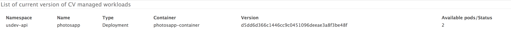

[](https://circleci.com/gh/nearmap/cvmanager)[](https://goreportcard.com/report/github.com/nearmap/cvmanager)


# CVManager
Container Version Manager (cvmanager) is a continous integration (CI) and continous delivery (CD) tool designed for Kubernetes cluster/services. Fundamentally, cvmanager is a custom Kubernetes controller to achieve a declarative configuration approach to continuous deployment. 

Deployments that requires CI/CD, can declare [ContainerVersion](k8s/cv-crd.yaml) resource. [CVManager](k8s/Backend.yaml), ContainerVersion (CV) controller starts monitoring for any new changes that should be rolled-out. If so, using the rollout strategy specified in this deployment, the rollout of new version is carried out.

CVManager assumes ECR as the container registry. Supporting other registeries is T2D.

The tool has 3 main parts:
- CV Manager
- Docker Registry Syncer (supports ECR and Dockerhub)
- Docker Registry Tagger (supports ECR, with limited Dockerhub support)

Docker images are on [docker.io](https://hub.docker.com/r/nearmap/cvmanager/)

## CVManager: Controller service
ContainerVersion controller that manages ContainerVersion resources.

### Run locally
```sh
 cvmanager run --k8s-config ~/.kube/config --configmap-key=kube-system/cvmanager
```

## Docker registry sync service

Registry sync service is a polling service that frequently check on registry (AWS ECR and dockerhub only) to see if new version should be rolled out for a given deployment/container.

Sync service default to using AWS ECR as regisrty provider but dockerhub is also supported. Use ```--provider dockerhub``` to use syncer service against dockerhub repo.

Dockerhub *note*: 
Dockerhub has very limited support w.r.t. tags via API and also multi-tag support is very limited. see [1](https://github.com/kubernetes/kubernetes/issues/33664), [2](https://github.com/kubernetes/kubernetes/issues/11348), [3](https://github.com/docker/hub-feedback/issues/68) and [4](https://github.com/kubernetes/kubernetes/issues/1697) for more info.
When using dockerhub, regisrty syncer monitors a tag (example latest) and when the latest image is change i.e. the digest of the image is changed Syncer picks it up as a candidate deployment and deploys new version. 


### Run locally
```sh
    cvmanager cr sync \
    --namespace=usdev-api \
    --provider=ecr \
    --cv=photos-cv \
    --k8s-config ~/.kube/config
```


### ECR Tagger Util
A tagging tool that integrates with CI side of things to manage tags on the ECR repositories.

#### Get Tag
```sh
    cvmanager cr tags get \
    --repo  nearmap/cvmanager  \
    --version <SHA>
```

#### Add Tag
```sh
    cvmanager cr tags remove \
    --repo  nearmap/cvmanager  \
    --tags env-audev-api,env-usdev-api \
    --version <SHA>
```

#### Remove Tag
```sh
    cvmanager cr tags remove \
    --repo  nearmap/cvmanager  \
    --tags env-audev-api,env-usdev-api
```


#### Supporting other docker registries
We plan to support other docker registries as well in future via cvmanager. 


## Building and running CVManager

### Build & Run
```sh
docker build -t nearmap/cvmanager .
docker run -ti  nearmap/cvmanager <command>
```

### Testing with docker-compose
```sh
 docker-compose down
 docker-compose rm -f
 docker-compose up --force-recreate --build --abort-on-container-exit
```


## Deploying CVManager to Kubernetes cluster
CVManager can be deployed using:

1. Kubectl: yaml specs for Kubenetes configuration is [here](kubectl/README.md)
2. Helm: Helm chart spec is [here](helm/cvmanager) and helm package is avaialble [here](https://raw.githubusercontent.com/nearmap/cvmanager/master/k8s/helm/cvmanager/cvmanager-0.1.0.tgz)

Please [see](k8s/README.md) for more info.


## Getting current version of all CV managed deployments 
- REST API ```http://<host>:8081/v1/cv/workloads``` is exposed that return naive html page with tabluar data of all CV managed deployments and current version
eg.
```json
[
   {
      "Namespace":"usdev-api",
      "Name":"photosapp",
      "Type":"Deployment",
      "Container":"photosapp-container",
      "Version":"d5dd6d366c1446cc9c0451096deeae3a8f3be48f",
      "AvailablePods":2,
      "CV":"photos-cv",
      "Tag":"env-usdev-api"
   }
]
```

- Html format can also be queried using ```format``` query, supported values are json/html. eg. ```http://localhost:8081/v1/cv/workloads?format=html```


- Same can also be generated by (use ```--k8s-config``` only if running outside cluster:
```sh
    cvmanager cv get --k8s-config ~/.kube/config
```

#### Reference links
- https://kccnceu18.sched.com/event/DquY/continuous-delivery-meets-custom-kubernetes-controller-a-declarative-configuration-approach-to-cicd-suneeta-mall-simon-cochrane-nearmap-intermediate-skill-level?iframe=no&w=100%&sidebar=yes&bg=no
