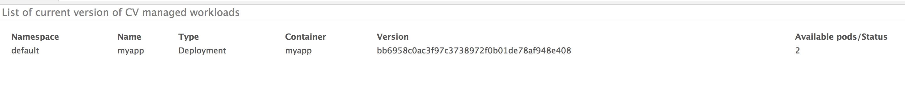

# KCD

[](https://circleci.com/gh/nearmap/kcd)
[](https://goreportcard.com/report/github.com/eric1313/kcd)
[](https://godoc.org/github.com/eric1313/kcd)


  

  


======

Kubernetes Continous Delivery (kcd), formally known as _Container_ _Version_ _Manager_ (_kcd_), is a continous integration (CI) and continous delivery (CD) tool designed for Kubernetes cluster/services. Fundamentally, kcd is a custom Kubernetes controller to achieve a declarative configuration approach to continuous deployment. 

Deployments that requires CI/CD, can declare [KCD](k8s/crd.yaml) resource. [kcd](k8s/kcd.yaml), KCD (Kubernetes Continous Delivery) controller starts monitoring for any new changes that should be rolled-out. If so, using the rollout strategy specified in this deployment, the rollout of new version is carried out.

kcd assumes ECR as the container registry. Supporting other registeries is T2D ([see](https://github.com/eric1313/kcd/issues/15)).

The tool has 3 main parts:
- KCD Controller
- KCD Syncer: Docker Registry Syncer (supports ECR and Dockerhub)
- KCD Tagger: Docker Registry Tagger (supports ECR, with limited Dockerhub support)

kcd logo.png

Docker images are on [docker.io](https://hub.docker.com/r/nearmap/kcd/)

## kcd: Controller service
Container version controller that manages KCD resources.

### Run locally
```sh
 kcd run --k8s-config ~/.kube/config --configmap-key=kube-system/kcd
```

## Docker registry sync service

Registry sync service is a polling service that frequently check on registry (AWS ECR and dockerhub only) to see if new version should be rolled out for a given deployment/container.

Sync service default to using AWS ECR as regisrty provider but dockerhub is also supported. Use ```--provider dockerhub``` to use syncer service against dockerhub repo.

Dockerhub *note*: 
Dockerhub has very limited support w.r.t. tags via API and also multi-tag support is very limited. see [1](https://github.com/kubernetes/kubernetes/issues/33664), [2](https://github.com/kubernetes/kubernetes/issues/11348), [3](https://github.com/docker/hub-feedback/issues/68) and [4](https://github.com/kubernetes/kubernetes/issues/1697) for more info.
When using dockerhub, regisrty syncer monitors a tag (example latest) and when the latest image is change i.e. the digest of the image is changed Syncer picks it up as a candidate deployment and deploys new version. 


### Run locally
```sh
    kcd registry sync \
    --namespace=usdev-api \
    --provider=ecr \
    --kcd=photos-kcd \
    --k8s-config ~/.kube/config
```


### ECR Tagger Util
A tagging tool that integrates with CI side of things to manage tags on the ECR repositories.

#### Get Tag
```sh
    kcd registry tags get \
    --repo  nearmap/kcd  \
    --version <SHA>
```

#### Add Tag
```sh
    kcd registry tags remove \
    --repo  nearmap/kcd  \
    --tags env-audev-api,env-usdev-api \
    --version <SHA>
```

#### Remove Tag
```sh
    kcd registry tags remove \
    --repo  nearmap/kcd  \
    --tags env-audev-api,env-usdev-api
```


#### Supporting other docker registries
We plan to support other docker registries as well in future via kcd. 


## Building and running kcd

### Build & Run
```sh
docker build -t nearmap/kcd .
docker run -ti  nearmap/kcd <command>
```

### Testing with docker-compose
```sh
 docker-compose down
 docker-compose rm -f
 docker-compose up --force-recreate --build --abort-on-container-exit
```


## Deploying kcd to Kubernetes cluster
*kcdanage is only supported on Kubernetes >= 1.9*

kcd can be deployed using:

1. Kubectl: yaml specs for Kubenetes configuration is [here](k8s/kubectl/README.md)
2. Helm: Helm chart spec is [here](k8s/helm/kcd) and helm package is avaialble [here](https://raw.githubusercontent.com/nearmap/kcd/master/k8s/helm/kcd/kcd-0.1.0.tgz)


Please [see](k8s/README.md) for more info.


## Getting current version of all CV managed deployments 
- REST API ```http://<host>:8081/v1/kcd/workloads``` is exposed that return naive html page with tabluar data of all CV managed deployments and current version
eg.
```json
[
   {
      "Namespace":"usdev-api",
      "Name":"photosapp",
      "Type":"Deployment",
      "Container":"photosapp-container",
      "Version":"d5dd6d366c1446cc9c0451096deeae3a8f3be48f",
      "AvailablePods":2,
      "CV":"photos-kcd",
      "Tag":"env-usdev-api"
   }
]
```

- Html format can also be queried using ```format``` query, supported values are json/html. eg. ```http://localhost:8081/v1/kcd/workloads?format=html```


- Same can also be generated by (use ```--k8s-config``` only if running outside cluster:
```sh
    kcd rd get --k8s-config ~/.kube/config
```


## Rollout history
Use ```--history``` CLI option on kcd to capture release history in configmap. 
- When history option is chosen, REST interface ```http://<host>:8081/v1/kcd/workloads/kcdapp?namespace=kube-system```, details the update/rollout history. 


- The history is stored in configmap under same namespace as workload resource with configmap name <workload_resource_name>.history eg kcdapp.history


#### Reference links
- https://kccnceu18.sched.com/event/DquY/continuous-delivery-meets-custom-kubernetes-controller-a-declarative-configuration-approach-to-cicd-suneeta-mall-simon-cochrane-nearmap-intermediate-skill-level-slides-attached
- KubeCon EU 2018 Presentation [download](./docs/KubeCon-EU-2018/presentation.pdf)
